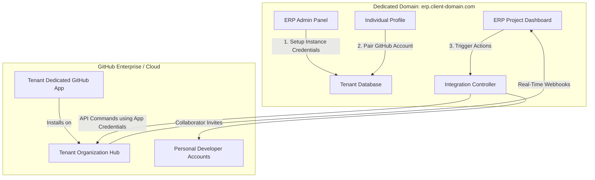
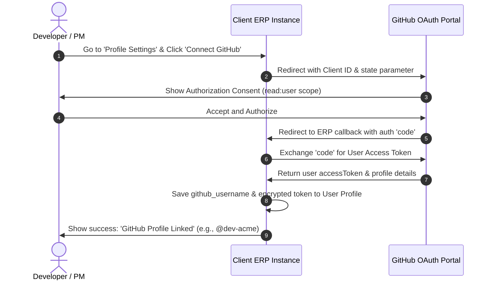
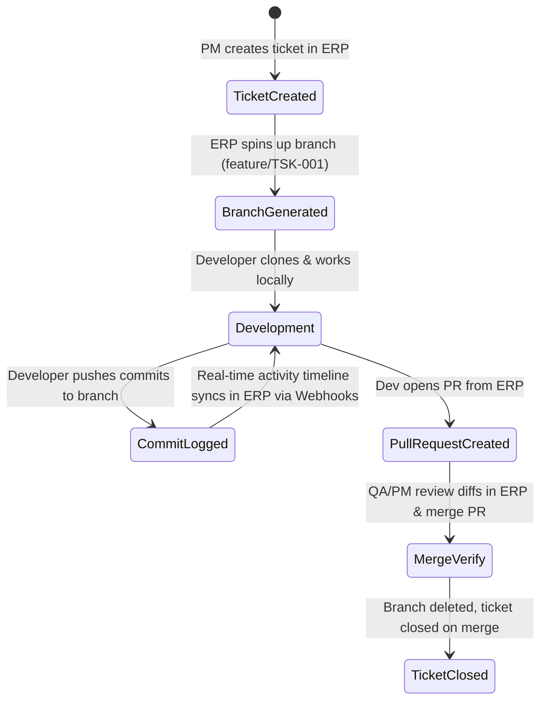

# White-Label Multi-Tenant GitHub Integration Blueprint

This document details the architectural design and system workflows to implement a premium, fully isolated **GitHub Integration Engine** for **Quantum Blaze ERP**. 

As a white-label, distributed ERP solution, each client instance operates on its own dedicated server and domain, completely isolated from the parent Quantum Blaze ecosystem. This blueprint outlines how tenant administrators configure organization links, and how team members pair personal profiles to automate project setup and repository collaboration.

---

## 🏗️ Architectural Topology

Each ERP deployment is structurally independent. To achieve absolute isolation, each tenant registers their own **GitHub App** (or OAuth App) dedicated exclusively to their domain, keeping all data, repositories, and user keys secure within their boundary.



---

## 🔐 1. Admin Installation & Organization Pairing (Tenant Level)

When the client deploys the ERP instance on their domain (e.g., `erp.acme.com`), the tenant Administrator configures their dedicated connection:

### Step-by-Step Flow:
1. **GitHub App Registration**: 
   - The ERP Admin Dashboard features an integration wizard that helps the Admin register a new **GitHub App** on their company's GitHub account.
   - The Admin configures the App's callback URL to point to their ERP instance: `https://erp.acme.com/api/auth/github/callback`.
2. **Key Installation**:
   - The Admin pastes the **App ID**, **Client ID**, **Client Secret**, and the generated **Private Key (.pem)** into the ERP Admin Settings.
   - These keys are stored securely using AES-256 symmetric encryption inside the tenant’s Postgres database (`settings` table).
3. **App Installation**:
   - The Admin clicks **"Install GitHub App"**, which redirects them to GitHub to authorize the app on their selected organizations (e.g., `github.com/acme-org`).
   - Once authorized, the App receives a unique `installation_id`. The ERP now has authorized API permissions to manage repositories, webhooks, and branches under that organization.

---

## 🧑‍💻 2. Personal GitHub Pairing (User Level)

To authorize individual operations, developers, PMs, and QAs link their personal GitHub accounts to their ERP profiles.



- **Scope Security**: The system requests minimal scopes (`read:user` and `repo` collaborator access), ensuring users' private credentials are never exposed beyond necessary limits.

---

## 🤝 3. Automated Project & Collaborator Flow

Once the admin app is active and team members are linked, project collaboration is fully automated inside the ERP.

### A. Repository & PM Collaboration Setup
1. **Repository Creation**:
   - The ERP Admin creates a new project card.
   - ERP calls GitHub API (`POST /orgs/{org}/repos`) using the GitHub App token to spin up a new repository: `acme-org/project-alpha`.
2. **Assigning the Project Manager**:
   - The PM is assigned by Admin.
   - Since the PM's GitHub account is paired (`@pm-acme`), the ERP instantly sends a collaboration request using GitHub API:
     ```http
     PUT /repos/acme-org/project-alpha/collaborators/pm-acme
     Content-Type: application/json
     { "permission": "admin" }
     ```
   - The PM receives the GitHub invite automatically.

### B. Developer Onboarding to Repository
1. **Assigning Developers to Tasks**:
   - The PM assigns a developer (e.g., John Doe, username: `@john-dev`) to a milestone or epic.
   - The ERP verifies John has linked his GitHub account.
   - ERP automatically invites John as a collaborator to the project repository:
     ```http
     PUT /repos/acme-org/project-alpha/collaborators/john-dev
     Content-Type: application/json
     { "permission": "push" }
     ```
   - John receives an instant invite on GitHub, granting him permission to clone and push code.

---

## 🚀 4. Automated Ticket to Branch Lifecycle

With all accounts linked, the daily developer workflow operates as a feedback loop.



### Dynamic Branching:
- **Automatic Setup**: Creating a ticket in the ERP automatically makes an API call to GitHub to create a matching branch:
  ```http
  POST /repos/acme-org/project-alpha/git/refs
  {
    "ref": "refs/heads/feature/TSK-001-login-screen",
    "sha": "{base_branch_head_sha}"
  }
  ```
- **Webhook Updates**: The GitHub App registers dynamic webhooks for repository events (`push`, `pull_request`, `issue_comment`).
- **Real-Time Timelines**: Whenever a developer pushes a commit, GitHub fires a webhook to the ERP's secure callback:
  ```http
  POST https://erp.acme.com/api/webhooks/github
  ```
  The ERP captures the commit message, files changed, and updates the task card's timeline dynamically.

---

## 💾 Proposed Database Schema Extensions

To support this multi-tenant integration flow, the following schema extensions will be added:

```typescript
// Proposed schema updates for Drizzle ORM

// 1. Store client's instance-level GitHub App configurations
export const tenantSettings = pgTable("tenant_settings", {
  id: varchar("id", { length: 255 }).primaryKey(),
  githubAppId: varchar("github_app_id", { length: 255 }),
  githubClientId: varchar("github_client_id", { length: 255 }),
  githubClientSecret: text("github_client_secret_encrypted"),
  githubPrivateKey: text("github_private_key_encrypted"),
  githubOrgName: varchar("github_org_name", { length: 255 }),
  updatedAt: timestamp("updated_at").defaultNow(),
});

// 2. Pair users with their individual GitHub accounts
export const userGithubAccounts = pgTable("user_github_accounts", {
  userId: varchar("user_id", { length: 255 }).references(() => users.id).primaryKey(),
  githubUsername: varchar("github_username", { length: 255 }).notNull(),
  githubUserId: varchar("github_user_id", { length: 255 }),
  accessTokenEncrypted: text("access_token_encrypted"),
  refreshTokenEncrypted: text("refresh_token_encrypted"),
  tokenExpiresAt: timestamp("token_expires_at"),
  createdAt: timestamp("created_at").defaultNow(),
});

// 3. Map project milestones with GitHub Repositories
export const projectRepositories = pgTable("project_repositories", {
  id: varchar("id", { length: 255 }).primaryKey(),
  projectId: varchar("project_id", { length: 255 }).references(() => projects.id),
  repoOwner: varchar("repo_owner", { length: 255 }).notNull(), // organization or user
  repoName: varchar("repo_name", { length: 255 }).notNull(),
  webhookId: varchar("webhook_id", { length: 255 }),
  createdAt: timestamp("created_at").defaultNow(),
});
```
